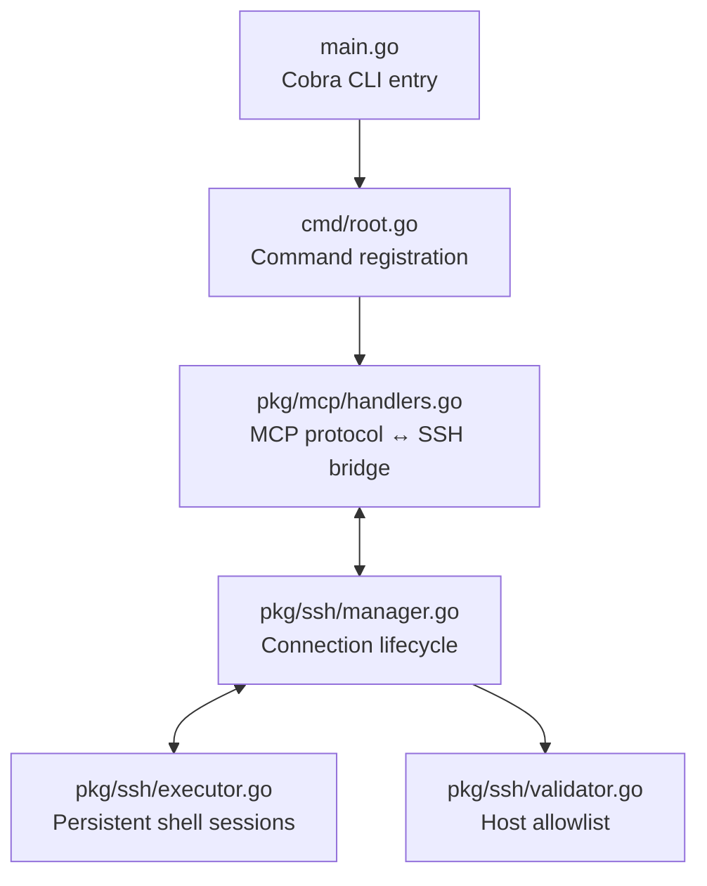

# MCP SSH Server

A Model Context Protocol (MCP) server that provides AI agents with persistent SSH shell sessions to remote hosts. Environment and directory state persists across multiple command executions within the same connection.

[](https://go.dev/dl/)
[](LICENSE)

## Features

- **Persistent Shell Sessions** - Working directory and environment variables persist between commands
- **Multiple Connections** - Manage several SSH connections simultaneously
- **Host Allowlisting** - Glob pattern support (e.g., `192.168.1.*`, `*.example.com`)
- **Async Execution** - Run long-running commands in the background
- **Output Controls** - Limit output by lines or bytes, detect binary data
- **PTY Support** - Allocate pseudo-terminals for interactive applications
- **Pure Go** - No external dependencies beyond the standard library and MCP SDK

## Installation

```bash
# Build from source
go build -o mcp-ssh .

# Or install globally
go install
```

## Quick Start

```bash
# Start the server with host restrictions
mcp-ssh --allowed-hosts "192.168.1.*,*.example.com"

# With custom command timeout (default: 30s)
mcp-ssh --allowed-hosts "192.168.1.*" --command-timeout 60s
```

## CLI Flags

| Flag | Required | Default | Description |
|------|----------|---------|-------------|
| `--allowed-hosts` | Yes | - | Comma-separated host patterns with glob support |
| `--command-timeout` | No | `30s` | Timeout for command execution |
| `--log-level` | No | `info` | Log level: debug, info, warn, error |
| `--log-file` | No | stderr | Path to log file (empty = stderr) |

## MCP Tools

### `ssh_connect`

Establishes an SSH connection with a persistent shell session.

**Parameters:**
- `connection_id` (string, required) - Unique identifier for this connection
- `host` (string, required) - Remote host address
- `username` (string, required) - SSH username
- `port` (number, optional) - SSH port (default: 22)
- `password` (string, optional) - Password authentication
- `private_key_path` (string, optional) - Path to private key file

**Example:**
```json
{
  "connection_id": "web-server",
  "host": "192.168.1.100",
  "username": "admin",
  "password": "secret"
}
```

### `ssh_execute`

Executes a command on an active connection. The shell state (cwd, environment) persists between calls.

**Parameters:**
- `connection_id` (string, required) - Connection identifier
- `command` (string, required) - Command to execute
- `max_lines` (number, optional) - Maximum output lines (0 = unlimited)
- `max_bytes` (number, optional) - Maximum output bytes (0 = unlimited)
- `use_login_shell` (boolean, optional) - Use login shell to source profiles (default: false)
- `enable_pty` (boolean, optional) - Allocate PTY for interactive apps (default: false)
- `pty_cols` (number, optional) - PTY columns (default: 80)
- `pty_rows` (number, optional) - PTY rows (default: 24)

**Response:**
```json
{
  "success": true,
  "stdout": "...",
  "stderr": "...",
  "exit_code": 0,
  "signal": 0,
  "signal_name": "",
  "timed_out": false,
  "binary_output": false
}
```

### `ssh_execute_async`

Starts a command execution in the background. Returns immediately with a job ID.

**Parameters:** Same as `ssh_execute`, plus:
- (inherits all ssh_execute parameters)

**Response:**
```json
{
  "success": true,
  "job_id": "job_1234567890"
}
```

### `ssh_job_status`

Gets the status of an async job.

**Parameters:**
- `job_id` (string, required) - Job identifier returned by `ssh_execute_async`

**Response:**
```json
{
  "success": true,
  "job": {
    "id": "job_1234567890",
    "status": "completed",
    "result": {
      "stdout": "...",
      "stderr": "...",
      "exit_code": 0
    }
  }
}
```

### `ssh_job_cancel`

Cancels a running or pending job.

**Parameters:**
- `job_id` (string, required) - Job identifier

### `ssh_job_list`

Lists all background jobs for a connection.

**Parameters:**
- `connection_id` (string, required) - Connection identifier

### `ssh_close`

Closes an SSH connection and cleans up the session.

**Parameters:**
- `connection_id` (string, required) - Connection to close

### `ssh_list`

Lists all active connections.

## Usage Example

```json
// 1. Connect to a server
{"tool": "ssh_connect", "params": {"connection_id": "prod", "host": "192.168.1.100", "username": "admin", "password": "..."}}

// 2. Navigate and run commands (state persists)
{"tool": "ssh_execute", "params": {"connection_id": "prod", "command": "cd /var/log && ls -la"}}
{"tool": "ssh_execute", "params": {"connection_id": "prod", "command": "tail -f syslog"}}  // Still in /var/log!

// 3. Run a long command in background
{"tool": "ssh_execute_async", "params": {"connection_id": "prod", "command": "find / -name '*.log'"}}
{"tool": "ssh_job_status", "params": {"job_id": "job_123"}}

// 4. Close when done
{"tool": "ssh_close", "params": {"connection_id": "prod"}}
```

## Claude Desktop Configuration

Add to your Claude Desktop config file:

**macOS:** `~/Library/Application Support/Claude/claude_desktop_config.json`
**Windows:** `%APPDATA%\Claude\claude_desktop_config.json`

```json
{
  "mcpServers": {
    "ssh": {
      "command": "/path/to/mcp-ssh",
      "args": [
        "--allowed-hosts",
        "192.168.1.*,*.example.com,10.0.0.0/8"
      ]
    }
  }
}
```

## Security Considerations

- **Host Key Verification** is disabled (`InsecureIgnoreHostKey()`) for flexibility with dynamic SSH connections. For production environments with known hosts, consider implementing proper host key verification.
- **Always use `--allowed-hosts`** to restrict which servers can be accessed. Patterns support wildcards (`*.example.com`) and IP ranges.
- **Credentials** are handled in memory only and never written to logs.
- **No encryption** beyond what the SSH connection provides - ensure your network path is trusted.

## Architecture



### Key Components

- **manager.go** - Thread-safe connection pool with `sync.RWMutex`. Stores connections by user-provided `connection_id`.
- **executor.go** - Manages persistent shell sessions using delimiter-based output capture (`__MCP_SSH_END_<nonce>__`). Commands include an echo delimiter to parse exit codes.
- **validator.go** - Host allowlist with glob pattern support for `*` wildcard matching.

## Development

```bash
# Build
make build

# Run tests
make test

# Run tests with race detector
make test-race

# Lint
make lint

# Run all checks
make check

# Cross-compile for multiple platforms
make build-all
```

## License

MIT
